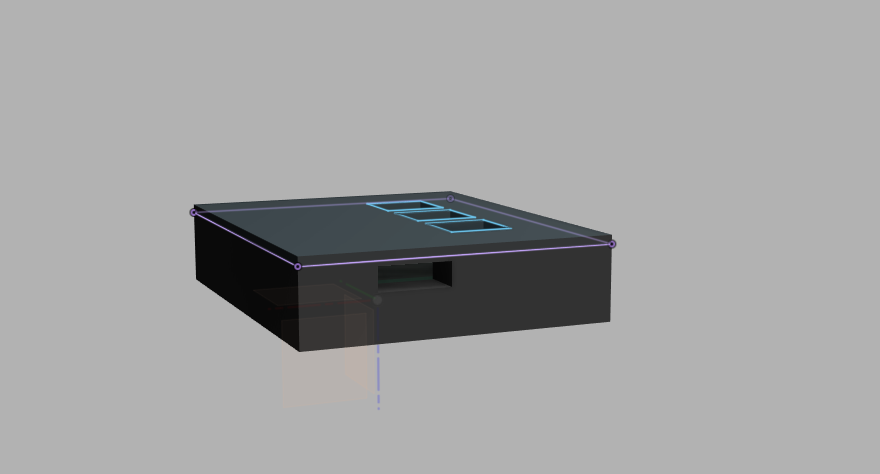
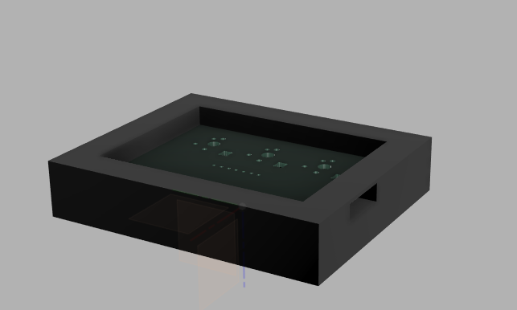
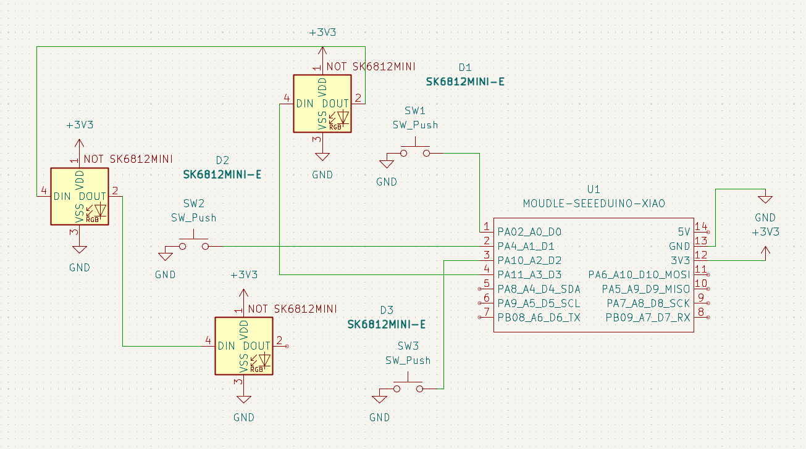
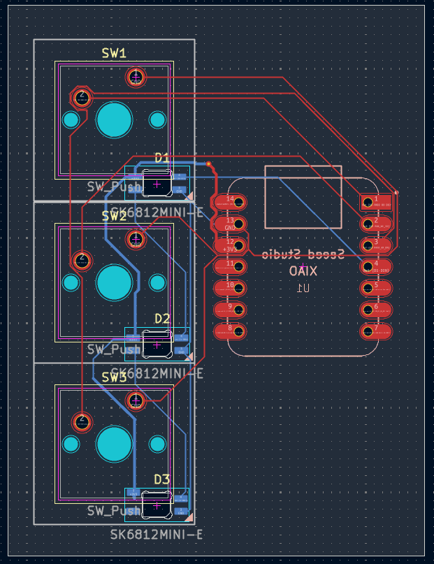

# ⌨️ Tecladinho Macropad Custom

Este projeto consiste no desenvolvimento completo de um teclado macropad customizado, integrando o design de circuito eletrônico no **KiCad** e a modelagem mecânica do estojo no **Autodesk Fusion 360**. O projeto foi dimensionado parametricamente para garantir encaixes precisos e furos adequados para inserts rosqueados (heatsets).

---

## 📸 Demonstração do Projeto

### Render / Captura do Design do Macropad



### Desenho Técnico e Modelagem 3D do Estojo



---

## ⚡ Desenvolvimento Eletrônico (KiCad)

O circuito foi planejado para ser compacto e funcional, utilizando um microcontrolador centralizado e furos de montagem estrategicamente posicionados nos quatro cantos da placa.

### Esquema Elétrico



### Layout do PCB (Edge Cuts e Trilhas)



---

## 🛠️ Especificações do Estojo (Fusion 360)

O estojo inferior foi modelado utilizando técnicas de design paramétrico a partir do arquivo STEP exportado do KiCad, seguindo as seguintes especificações técnicas:

- **Tolerância interna do PCB:** `0.4 mm` em cada lado para garantir folga na montagem.
- **Espessura das paredes:** `10.0 mm` para alta resistência estrutural e acústica.
- **Espessura da base:** `3.0 mm`.
- **Recorte da porta USB-C:** Alinhado com o conector físico e folga de `0.2 mm`.
- **Fixação:** 4 colunas de reforço (_bosses_) nos cantos com furos cegos de fundo chato de **Ø 4.7 mm** para instalação de inserts de latão via calor.

---

## 📦 Lista de Materiais (BOM)

A tabela abaixo lista todos os componentes necessários para a montagem completa do hardware e da estrutura mecânica:

| Item | Componente                    | Quantidade | Descrição / Especificação                                |
| :--- | :---------------------------- | :--------: | :------------------------------------------------------- |
| 1    | PCB customizada               |     1      | Placa de circuito impresso desenvolvida no KiCad         |
| 2    | Microcontrolador XIAO_RP2040  |     1      | Seeed Studio XIAO RP2040 ou compatível com CircuitPython |
| 3    | Switches mecânicos            |     3      | Switches tipo Cherry MX ou compatíveis                   |
| 4    | Keycaps                       |     3      | Keycaps compatíveis com switches MX                      |
| 5    | LEDs                          |     3      | LEDs conectados ao pino D3                               |
| 6    | Inserts heat-set              |     4      | Inserts de latão M3 × 5 × 4 mm                           |
| 7    | Parafusos M3                  |     4      | Parafusos M3 × 16 mm                                     |
| 8    | Estojo inferior               |     1      | Peça impressa em 3D a partir do arquivo `Bottom.STEP`    |
| 9    | Tampa superior / switch plate |     1      | Peça impressa em 3D a partir do arquivo `Top.STEP`       |
| 10   | Cabo USB-C                    |     1      | Cabo para conexão do macropad ao computador              |

---# ⌨️ Tecladinho Macropad Custom

Este projeto consiste no desenvolvimento completo de um **macropad customizado de 3 teclas**, integrando o design eletrônico feito no **KiCad**, a modelagem mecânica do estojo no **Autodesk Fusion 360** e o firmware em **KMK/CircuitPython** para controle de mídia.

O macropad foi projetado para executar comandos rápidos de música:

- Tecla 1: música anterior
- Tecla 2: próxima música
- Tecla 3: pausar/reproduzir

---

## ⚡ Desenvolvimento Eletrônico

A PCB foi desenvolvida no **KiCad** com foco em simplicidade e compactação. O projeto utiliza um microcontrolador compatível com CircuitPython e três teclas mecânicas para controle de mídia.

### Pinos utilizados

| Função                    | Pino |
| :------------------------ | :--: |
| Tecla 1 — música anterior |  D0  |
| Tecla 2 — próxima música  |  D1  |
| Tecla 3 — play/pause      |  D2  |
| LEDs                      |  D3  |

As três teclas são utilizadas como entradas digitais no firmware, enquanto os LEDs são controlados pelo pino D3.

---

## 💻 Firmware

O firmware foi desenvolvido utilizando **KMK**, que roda sobre **CircuitPython**. Essa escolha facilita a configuração do teclado, permitindo editar o comportamento das teclas diretamente em Python.

### Funções das teclas

| Tecla | Ação            |
| :---: | :-------------- |
|   1   | Música anterior |
|   2   | Próxima música  |
|   3   | Play/Pause      |

### Arquivo principal

O firmware principal deve ser salvo no XIAO como:

```text
main.py
```

### Código base

```python
import board

from kmk.kmk_keyboard import KMKKeyboard
from kmk.keys import KC
from kmk.scanners.keypad import KeysScanner

keyboard = KMKKeyboard()

# Teclas conectadas nos pinos D0, D1 e D2.
# Cada tecla fecha contato com GND quando pressionada.
keyboard.matrix = KeysScanner(
    pins=(board.D0, board.D1, board.D2),
    value_when_pressed=False,
    pull=True,
)

# Mapa das teclas:
# Tecla 1: música anterior
# Tecla 2: próxima música
# Tecla 3: play/pause
keyboard.keymap = [
    [
        KC.MPRV,
        KC.MNXT,
        KC.MPLY,
    ]
]

# LEDs conectados ao pino D3.
# Este bloco considera LEDs endereçáveis do tipo NeoPixel/WS2812.
try:
    import neopixel

    NUM_LEDS = 3

    leds = neopixel.NeoPixel(
        board.D3,
        NUM_LEDS,
        brightness=0.25,
        auto_write=True,
    )

    leds.fill((0, 0, 255))

except Exception:
    pass


if __name__ == "__main__":
    keyboard.go()
```

---

## 🛠️ Modelagem Mecânica

O estojo foi modelado no **Autodesk Fusion 360** a partir das dimensões da PCB exportada do KiCad em formato STEP.

O modelo é dividido em duas partes:

- `Top.STEP` — tampa superior / switch plate
- `Bottom.STEP` — base inferior do estojo

### Especificações do estojo

| Elemento             | Especificação                                  |
| :------------------- | :--------------------------------------------- |
| Folga interna da PCB | 0,4 mm em cada lado                            |
| Espessura da base    | 3 mm                                           |
| Altura das paredes   | Ajustada para proteger a PCB e alinhar o USB-C |
| Recorte USB-C        | Alinhado ao conector físico da placa           |
| Fixação interna      | Colunas com insertos heat-set                  |
| Furos para insertos  | Ø 4,7 mm × 4 mm de profundidade                |
| Parafusos            | M3 × 16 mm                                     |

---

## 🚀 Exportação dos Arquivos para Produção

Os arquivos mecânicos devem ser exportados em formato **STEP**, e não em STL, para preservar a geometria CAD com maior precisão.

### Arquivos necessários

```text
Top.STEP
Bottom.STEP
```

### Exportando no Fusion 360

1. No Fusion 360, deixe visível apenas a peça que deseja exportar.
2. Esconda a PCB e os outros componentes.
3. Clique com o botão direito no componente desejado.
4. Selecione **Exportar**.
5. Escolha o formato **STEP**.
6. Exporte cada peça separadamente:

```text
Top.STEP     → tampa superior / switch plate
Bottom.STEP  → base inferior do estojo
```

---

## 📁 Estrutura sugerida do repositório

```text
tecladinho-macropad/
├── README.md
├── firmware/
│   └── code.py
├── case/
│   ├── Top.STEP
│   └── Bottom.STEP
├── kicad/
│   ├── esquema/
│   └── pcb/
└── images/
    ├── box.png
    ├── electric_schema.png
    ├── opened_box.png
    └── PCB_layout.png
```

---

## ✅ Status do Projeto

- [x] Esquema elétrico no KiCad
- [x] Layout da PCB
- [x] Modelagem do estojo inferior
- [x] Modelagem da tampa superior
- [x] Firmware básico em KMK
- [x] Exportação dos arquivos STEP
- [ ] Montagem física
- [ ] Teste final do firmware

---

## 🧠 Autor

Projeto desenvolvido por **Arthur Lima Manenti** como um macropad customizado de 3 teclas para controle de mídia.

## 🚀 Como Exportar os Arquivos para Produção

De acordo com as diretrizes do projeto, os arquivos estruturais devem ser exportados e enviados no formato **.STEP** para preservar as curvas e geometrias exatas para a equipe de impressão 3D:

1. No Fusion 360, vá em **File ➔ Export**.
2. Altere o tipo de arquivo para **.STEP**.
3. Exporte as duas partes separadamente:
   - `Topo.STEP` — A placa de comutação superior.
   - `Inferior.STEP` — A casca/estojo inferior.
